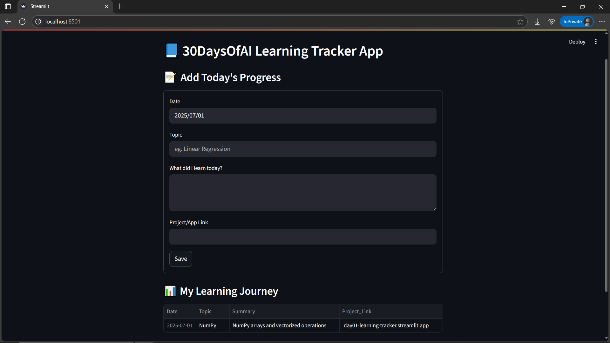

# Day01 – 30DaysOfAI Learning Tracker 🧠

This Streamlit app helps track the day-wise learning journey.

### Features
- Add daily topics, summaries, and resources
- Link to any GitHub repos or deployed projects
- View past entries in a table
- Local CSV file for persistent tracking

## 📸 Screenshot



### Run the App

```bash
git clone https://github.com/ravi18kumar2021/30DaysOfAI.git
cd 30DaysOfAI/Day01
streamlit run app.py