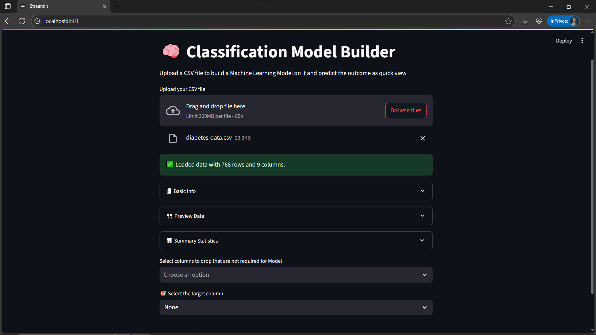
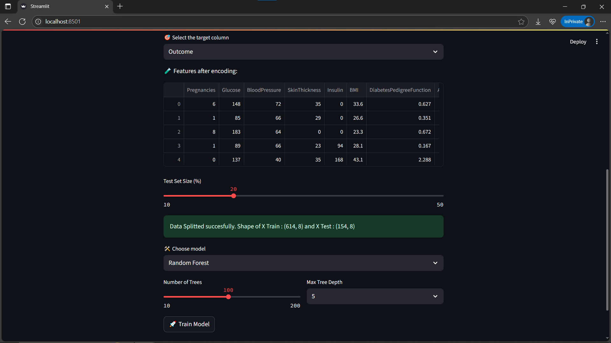
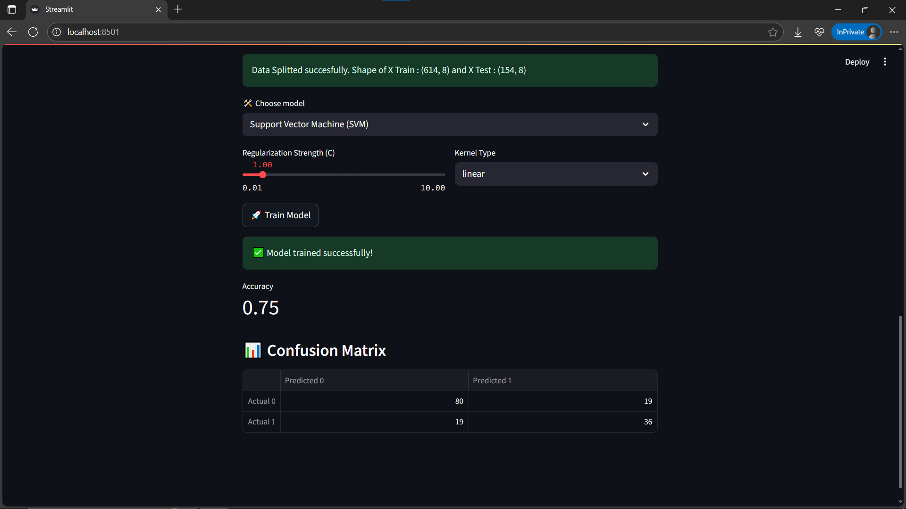

# 🧠 Classification Model Builder – Day 2 of 30DaysOfAI

This Streamlit app lets you **build, tune, and evaluate machine learning classification models** directly from a CSV file — no coding required. Designed for beginners and data science learners, it walks you through the entire model-building process interactively.

---

## 🚀 Features

- 📁 Upload a structured CSV file with labeled data
- 🗃️ Drop irrelevant columns before training
- 🎯 Choose the target column (classification only)
- ⚙️ Select and tune one of 5 classification models:
  - Random Forest
  - Logistic Regression
  - K-Nearest Neighbors (KNN)
  - Support Vector Machine (SVM)
  - Gradient Boosting
- ⚙️ Tune basic hyperparameters using sliders/dropdowns
- 🚀 Train/test split and accuracy evaluation
- 📊 View predictions and confusion matrix

---

## 🛠 Models & its Hyperparameters

| Model | Tunable Parameters |
|-------|--------------------|
| Random Forest | Number of Trees, Max Depth |
| Logistic Regression | Regularization Strength `C`, Max Iterations |
| KNN | Neighbors `k`, Weighting |
| SVM | Regularization Strength `C`, Kernel Type |
| Gradient Boosting | Trees, Learning Rate |

Sliders and dropdowns are used to simplify hyperparameter tuning.

---

## 📂 Project Structure

```bash
day02_classification_model_builder/
├── app.py
└── README.md
└── screenshot1.png
└── screenshot2.png
└── screenshot3.png
```
## 📸 Screenshot







### Run the App

```bash
git clone https://github.com/ravi18kumar2021/30DaysOfAI.git
cd 30DaysOfAI/Day02
streamlit run app.py
```

## ✅ Optional: `requirements.txt` to Include

```txt
streamlit
pandas
numpy
scikit-learn
```